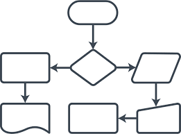

<h1 align="center">
  Readme-template
</h1>


# About The App

_Lorem Ipsum_ is simply dummy text of the printing and typesetting industry. **Lorem Ipsum** has been the industry's standard dummy text ever since the 1500s, when an unknown printer took a galley of type and scrambled it to make a type specimen book. It has survived not only five centuries, but also the leap into electronic typesetting, remaining essentially unchanged.

> It was popularised in the 1960s with the release of Letraset sheets containing Lorem Ipsum passages, and more recently with desktop publishing software like Aldus PageMaker including versions of Lorem Ipsum.

---

## Architecture Diagram



Add here description of the Architecture Diagram

---

## Installation

```bash
$ yarn install
```

## Pre-Configuration

```
**package.json**
----------

- Windows:
  "start:dev": "set STAGE=dev& nest start --watch",

- Linux / Ubuntu / Mac:
  "start:dev": "STAGE=dev nest start --watch",

```

---

## Add Environment variables

Please refer [.env.example](./.example.env) for the env variables that is needed

---

## Running the app

```bash
# development
$ yarn run start

# watch mode
$ yarn run start:dev

# staging mode
$ yarn run start:staging

# uat mode
$ yarn run start:uat

# production mode
$ yarn run start:prod
```

---

## Swagger Docs

After running the app, navigate to the path [http://localhost:3000/api/documentation](http://localhost:3000/api/documentation) to view swagger UI

---

## Running The Test Cases

```bash
# unit tests
$ yarn run test

# e2e tests
$ yarn run test:e2e

# test coverage
$ yarn run test:cov
```
